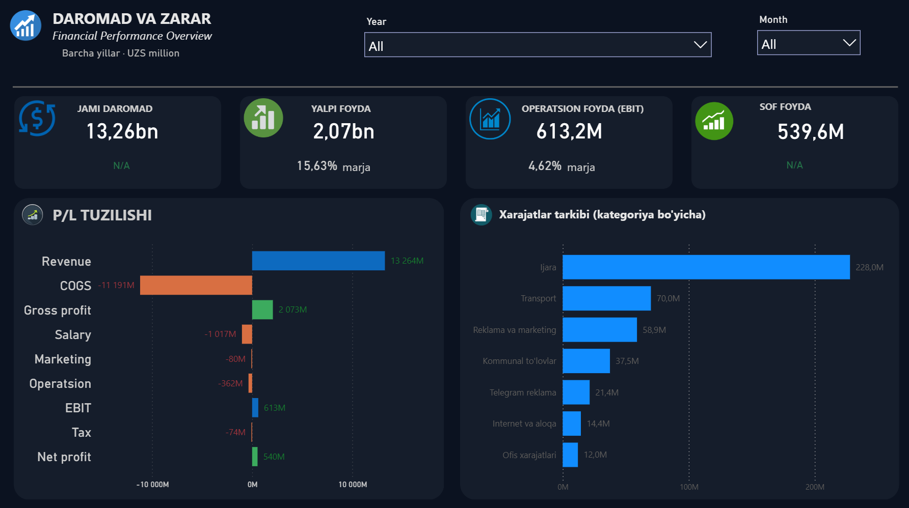
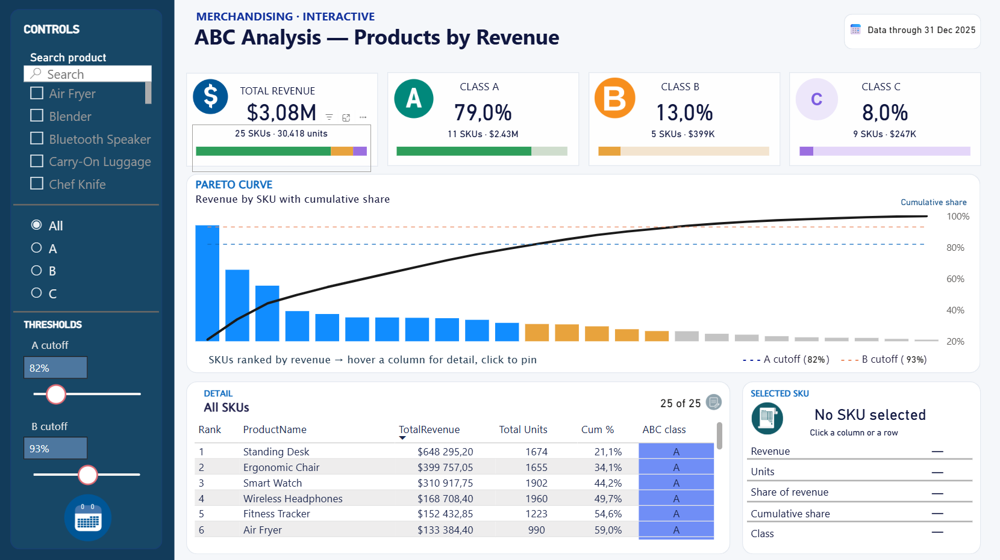
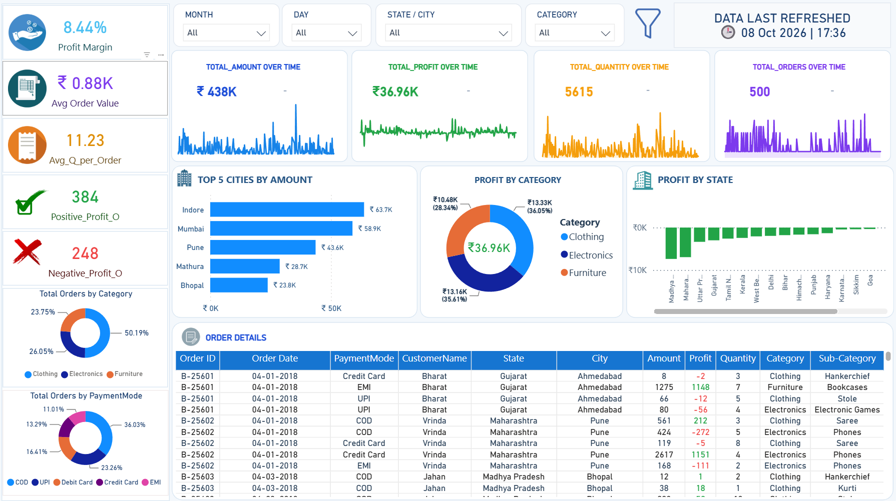
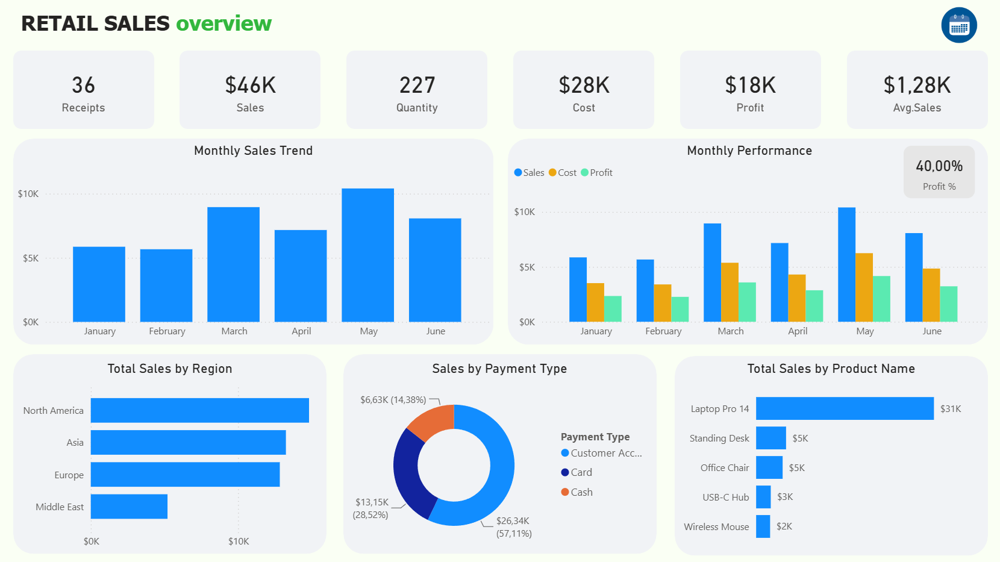

# 📊 Power BI Portfolio

A collection of interactive **Power BI** dashboards covering product analytics, sales performance, retail operations and financial reporting.
Each project folder contains the `.pbix` file, screenshots and a short write-up of the business questions, key metrics and findings.

**Author:** Azizbek Gulmonov — Junior Data Analyst · Tashkent, Uzbekistan
[GitHub](https://github.com/Azizbek0828) · [Telegram](https://t.me/ago_101)

---

## 🗂 Projects

| | Project | What it answers | Highlights |
|---|---|---|---|
|  | **[TezSavdo Retail Chain — Executive Report](tez-savdo/)** | How is a 10-store retail chain performing against plan? | 6-page report · targets & attainment · LFL growth · customer & discount analysis |
|  | **[Profit & Loss — Financial Overview](profit-and-loss/)** | Where does revenue go, and how much is left as profit? | Full P&L structure · margins · custom report-page tooltips (MoM / YoY) |
|  | **[ABC Analysis — Products by Revenue](abc-analysis/)** | Which products drive most of the revenue? | Pareto curve · adjustable A/B thresholds · SKU drill-down |
|  | **[E-commerce Sales Analysis](ecommerce-sales-analysis/)** | Which cities, categories and payment methods bring sales and profit? | KPI cards · profit by state & category · order-level detail |
|  | **[Retail Sales Overview](retail-sales-overview/)** | How do sales, cost and profit develop month by month? | Monthly trend · sales vs cost vs profit · region & product breakdown |

---

## 🛠 Skills demonstrated

- **Data modeling** — star schema, fact & dimension tables, relationships
- **DAX** — KPI measures, margins, cumulative share, targets & variance, time intelligence (MoM, YoY, LFL)
- **Power Query** — data cleaning and transformation
- **Report design** — KPI cards, slicers, drill-down, custom tooltips, multi-page navigation
- **Business analysis** — Pareto / ABC classification, P&L analysis, plan vs actual, customer segmentation

## 📁 Repository structure

```
powerbi-portfolio/
├── tez-savdo/                  # TezSavdo multi-page retail report
├── profit-and-loss/            # Financial performance (P&L)
├── abc-analysis/               # ABC / Pareto product analysis
├── ecommerce-sales-analysis/   # E-commerce sales & profit
└── retail-sales-overview/      # Monthly retail sales overview
```

Each folder: `*.pbix` (open with Power BI Desktop) · `images/` (screenshots) · `README.md` (project write-up).

> ℹ️ All dashboards are built on sample / practice datasets for learning and portfolio purposes.
