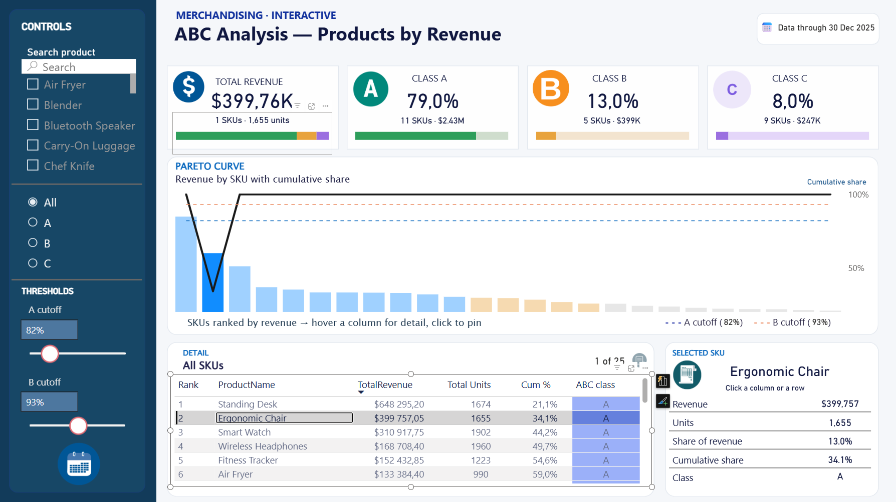

# 🅰️ ABC Analysis — Products by Revenue

An interactive merchandising dashboard that classifies products into **A, B and C classes** based on their contribution to total revenue, using the Pareto principle.

## 🎯 Business question

> *Which products generate most of our revenue, and which ones deserve less attention, shelf space or stock?*

ABC analysis helps merchandising and purchasing teams prioritise: **A** items are critical and must never be out of stock, **C** items are candidates for review.

## 📈 Key results

| Metric | Value |
|---|---|
| Total revenue | **$3.08M** |
| Products (SKUs) | **25** |
| Units sold | **30,418** |

| Class | SKUs | Revenue | Share of revenue |
|---|---|---|---|
| 🟢 **A** | 11 | $2.43M | **79.0%** |
| 🟠 **B** | 5 | $399K | 13.0% |
| 🟣 **C** | 9 | $247K | 8.0% |

## 💡 Insights

- **11 of 25 products (44%) generate 79% of revenue** — a classic Pareto distribution.
- The **top 3 products** — Standing Desk ($648K), Ergonomic Chair ($400K) and Smart Watch ($311K) — bring in **44%** of all revenue on their own.
- **Standing Desk alone accounts for 21%** of revenue, which makes it the single most important SKU to keep in stock.
- The **9 C-class products** together bring only 8% of revenue and are candidates for assortment review.

## ⚙️ Features

- **Pareto curve** — revenue per SKU (bars, coloured by class) with a cumulative share line and A/B cutoff lines
- **Adjustable thresholds** — A and B cutoffs (default 82% / 93%) can be changed with sliders, and every class updates instantly
- **Filters** — product search and class selector (All / A / B / C)
- **SKU drill-down** — click a bar or a table row to see that product's revenue, units, share and class

## 🧮 Key DAX logic

- **Total Revenue**, **Total Units**
- **Revenue Rank** — ranks products by revenue
- **Cumulative %** — running share of revenue in rank order
- **ABC Class** — assigns A / B / C by comparing the cumulative share with the threshold parameters
- **What-if parameters** for the A and B cutoffs

## 🛠 Tools

Power BI Desktop · DAX · Power Query · What-if parameters

## 📂 Files

- `abc-analysis.pbix` — Power BI report (open with Power BI Desktop)
- `images/` — screenshots
