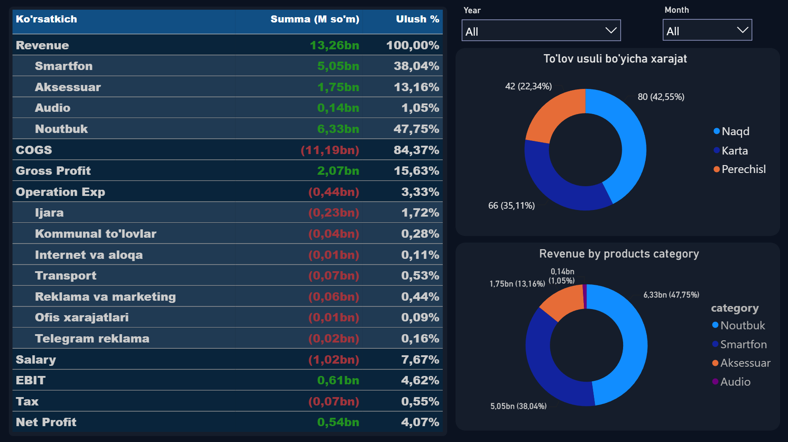
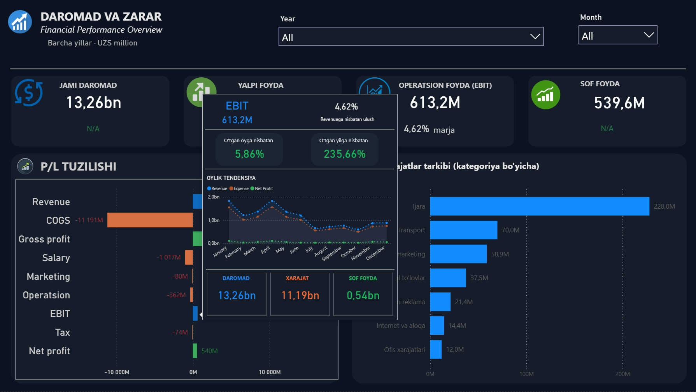
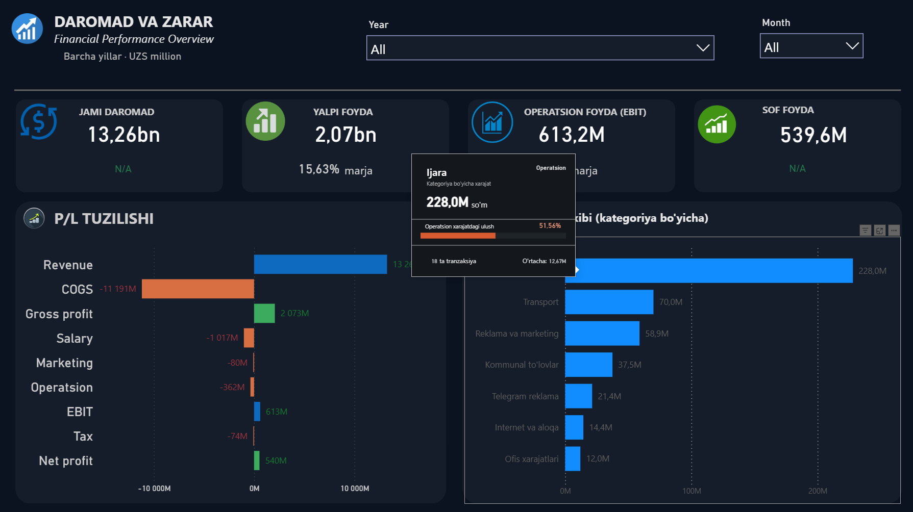

# 💰 Profit & Loss — Financial Performance Overview

*Daromad va zarar* — a financial dashboard for an electronics retailer that walks from **revenue to net profit** and shows exactly where the money goes. Amounts are in **UZS**; the report interface is in Uzbek.

## 🎯 Business questions

- How much of our revenue is left as **gross, operating and net profit**?
- Which **costs** take the biggest share?
- Which **product categories** generate revenue?

## 📈 Key results

| P&L line | Amount (UZS) | % of revenue |
|---|---|---|
| **Revenue** | **13.26bn** | 100% |
| Cost of goods sold (COGS) | −11.19bn | 84.4% |
| **Gross profit** | **2.07bn** | **15.6%** |
| Salary | −1.02bn | 7.7% |
| Operating expenses | −0.44bn | 3.3% |
| **EBIT (operating profit)** | **613.2M** | **4.6%** |
| Tax | −74M | 0.6% |
| **Net profit** | **539.6M** | **4.1%** |

## 💡 Insights

- **COGS takes 84% of revenue**, so margins are thin — typical for electronics retail. Small changes in purchase prices have a large effect on profit.
- **Salaries are the largest expense after COGS** (7.7% of revenue), more than twice all other operating costs combined.
- **Rent (Ijara) is 52% of operating expenses** (228M UZS), followed by transport (70M) and marketing (59M).
- **Laptops (47.8%)** and **smartphones (38.0%)** generate 86% of revenue; accessories add 13%, audio only 1%.
- Only **4.1% of revenue becomes net profit**.

## ⚙️ Features

- **P&L structure chart** — revenue, costs and profit levels in one view (positive vs negative values)
- **P&L matrix** — expandable hierarchy (revenue by category, expenses by type) with share of revenue
- **Expense breakdown** — operating costs by category and by payment method (cash, card, bank transfer)
- **Custom report-page tooltips:**
  - on P&L lines — value, share of revenue, **month-over-month** and **year-over-year** change and a monthly trend
  - on expense categories — amount, share of operating costs, number of transactions and average transaction

| EBIT tooltip | Expense tooltip |
|---|---|
|  |  |

## 🧮 Key DAX measures

Revenue · COGS · Gross Profit · Gross Margin % · Operating Expenses · EBIT · EBIT Margin % · Net Profit · Share of Revenue % · MoM % · YoY %

## 🛠 Tools

Power BI Desktop · DAX (time intelligence) · Power Query · Report-page tooltips

## 📂 Files

- `profit-and-loss.pbix` — Power BI report
- `images/` — screenshots
