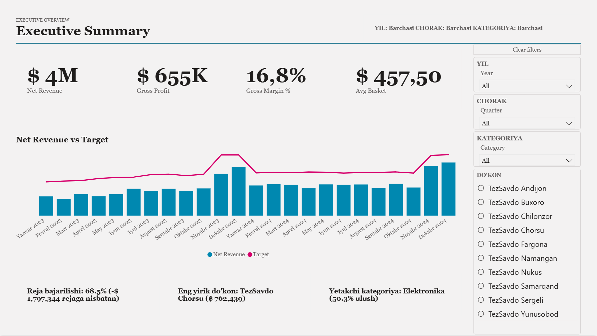
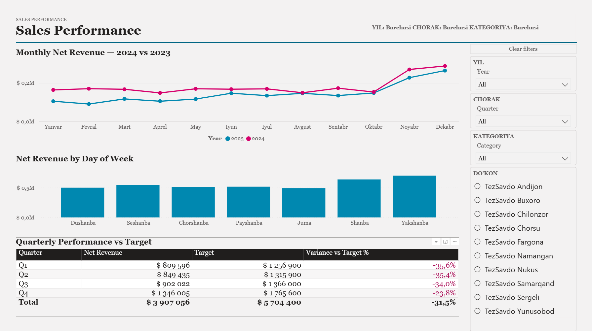
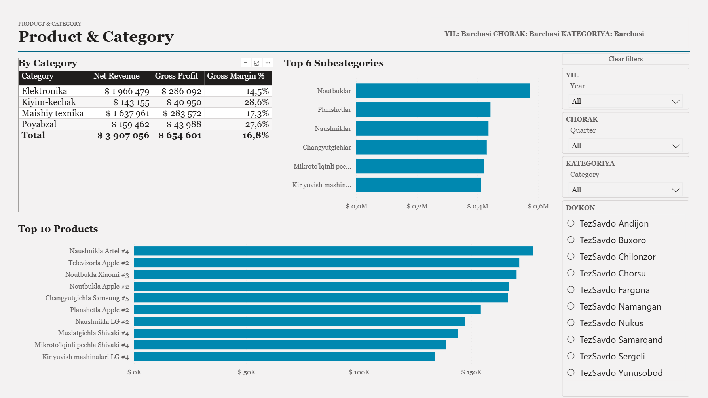
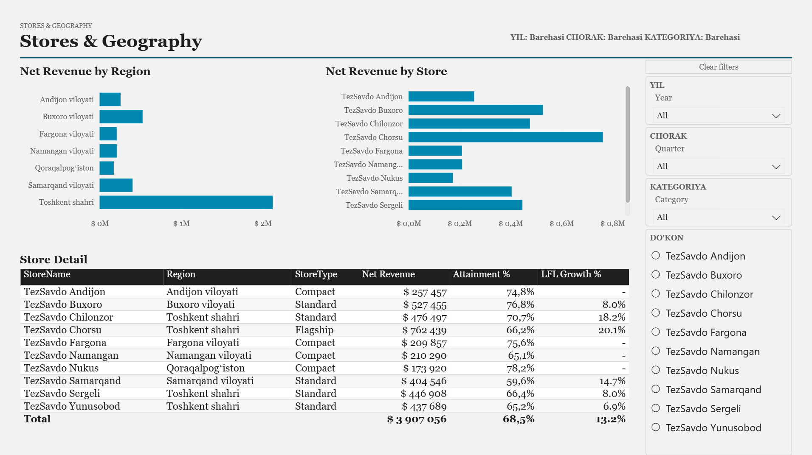
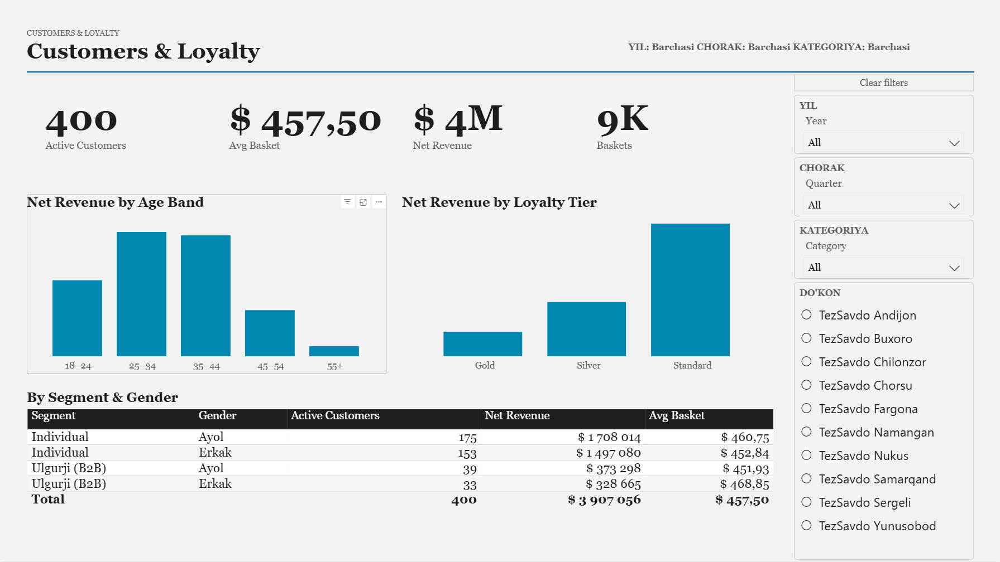
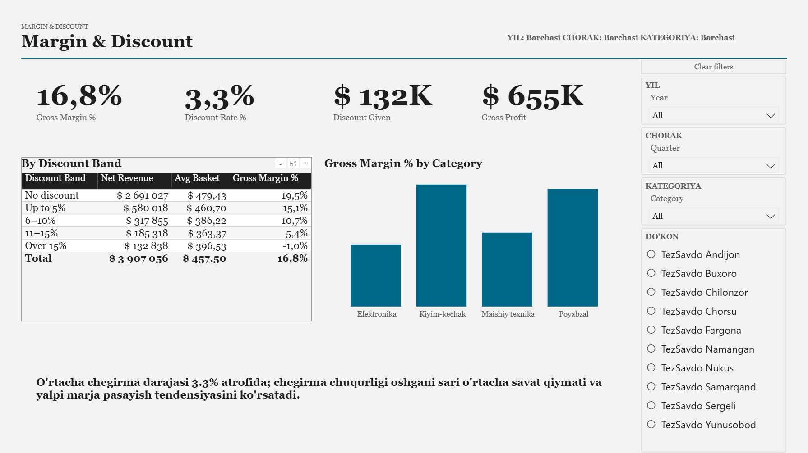

# 🏪 TezSavdo Retail Chain — Executive Report

A **6-page** Power BI report for *TezSavdo*, a retail chain with **10 stores across Uzbekistan**. It covers plan vs actual, sales trends, products, stores, customers and discounts for **2023–2024**. The report interface is partly in Uzbek.

## 🎯 Business questions

- Is the chain **meeting its revenue targets**?
- Which **stores, regions and categories** drive revenue and margin?
- Who are our **customers**, and how do **discounts** affect profitability?

## 📈 Headline numbers (2023–2024)

| Metric | Value |
|---|---|
| Net revenue | **$3.91M** |
| Gross profit | **$655K** |
| Gross margin | **16.8%** |
| Average basket | **$457.50** |
| Active customers | **400** |
| Baskets (transactions) | **~9K** |
| Plan attainment | **68.5%** (−$1.80M vs target) |
| Like-for-like growth | **+13.2%** |

## 💡 Key insights

- 🎯 **The chain missed its target by 31.5%** ($3.91M vs a $5.70M plan). Every quarter was below target, but the gap narrowed to −23.8% in Q4.
- 📅 **2024 beat 2023 in every month**, with a strong peak in **November–December**.
- 🗓 **Weekends (Saturday and Sunday) bring the highest revenue.**
- 🏆 **TezSavdo Chorsu** (flagship) is the largest store with **$762K** and the highest LFL growth (+20.1%). **Tashkent city** generates more revenue than all other regions combined.
- 📦 **Electronics brings 50% of revenue but has the lowest margin (14.5%).** Clothing (28.6%) and footwear (27.6%) are far more profitable per dollar sold.
- 👥 Customers aged **25–44** generate most of the revenue. Most revenue comes from the **Standard** loyalty tier, leaving room to grow Silver / Gold membership.
- 🏷 **Discounts erode margin:** sales without a discount earn a 19.5% margin, while discounts over 15% turn the margin **negative (−1.0%)**.

## 📑 Report pages

| Page | Content |
|---|---|
| **1. Executive Summary** | Headline KPIs, net revenue vs target by month, auto-generated key findings |
| **2. Sales Performance** | 2024 vs 2023 monthly revenue, revenue by weekday, quarterly performance vs target |
| **3. Product & Category** | Revenue and margin by category, top subcategories, top 10 products |
| **4. Stores & Geography** | Revenue by region and store, store type, attainment % and LFL growth |
| **5. Customers & Loyalty** | Active customers, revenue by age band and loyalty tier, segment & gender |
| **6. Margin & Discount** | Gross margin, discount rate, revenue and margin by discount band |

All pages share the same **slicer panel** (year, quarter, category, store), a **Clear filters** button and a **dynamic header** showing the active filters.

| | |
|---|---|
|  |  |
|  |  |
|  | |

## 🧮 Key DAX measures

Net Revenue · Gross Profit · Gross Margin % · Avg Basket · Baskets · Active Customers · Target · Variance vs Target % · Attainment % · LFL Growth % · Discount Given · Discount Rate % · dynamic text measures for the insight cards and filter header

## 🛠 Tools

Power BI Desktop · DAX (time intelligence, targets) · Power Query · Star-schema data model · Bookmarks

## 📂 Files

- `tez-savdo.pbix` — Power BI report
- `images/` — screenshots of all six pages
